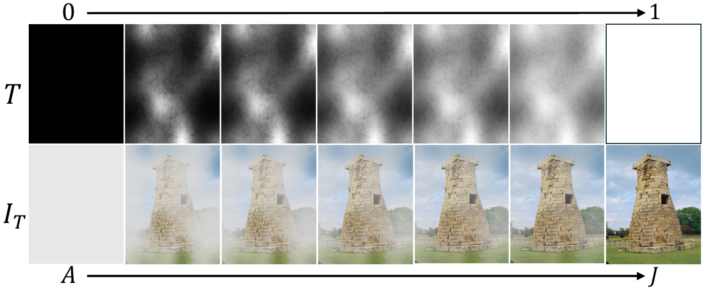
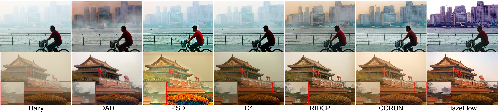
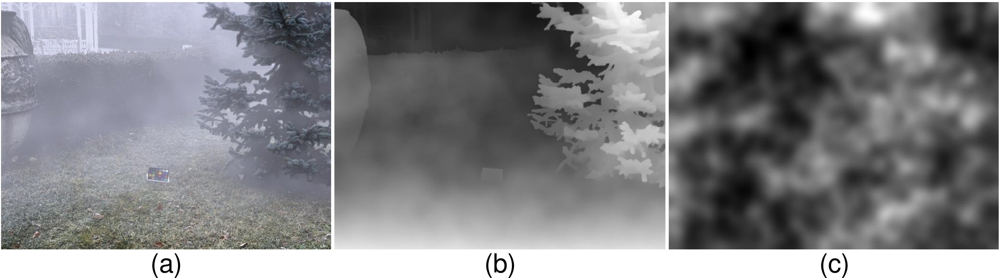

# HazeFlow : Revisit Haze Physical Model as ODE and Realistic Non-Homogeneous Haze Generation for Real-World Dehazing (ICCV2025)


<div style="display: flex; justify-content: space-between; align-items: baseline;">
  <h2 style="color: gray; margin: 0;">Authors </h2> 
</div>

<h3 style="margin-top: 0;">
  Junseong Shin*, <a href="https://cloor.github.io/">Seungwoo Chung*</a>, Yunjeong Yang, <a href="https://sites.google.com/view/lliger9">Tae Hyun Kim<sup>&#8224;</sup></a>
</h3>
<h4><sub><sup>(* denotes equal contribution.  <sup>&#8224;</sup> denotes corresponding author.)</sup></sub></h4>

<p align="center">
  
</p>


This is the official implementation of ICCV2025 "**HazeFlow**: Revisit Haze Physical Model as ODE and Realistic Non-Homogeneous Haze Generation for Real-World Dehazing" [[paper]]() / [[project page]](https://junsung6140.github.io/hazeflow/)

## Results
<p align="center">
  
</p>

More qualitative and quantitative results can be found on the [[project page]](https://junsung6140.github.io/hazeflow/).

## 📦 Installation
```bash
git clone https://github.com/cloor/HazeFlow.git
cd HazeFlow
pip install -r requirements.txt
```

or

```bash
git clone https://github.com/cloor/HazeFlow.git
cd HazeFlow
conda env create -f environment.yaml
```

Checkpoints can be downloaded [here](https://drive.google.com/file/d/1m8OVRi-3m7-u0bGWFS5W2ZpZM06XyLJd/view?usp=sharing).

## 🌫️ Haze Generation
<p align="center">
  
  <br>
  <b>Figure:</b> Example of non-homogeneous haze synthesized via MCBM. (a) Generated hazy image. (b) Transmission map <code>T<sub>MCBM</sub></code>. (c) Spatially varying density coefficient map <code>𝛽̃</code>.
</p>

You can generate haze density maps using MCBM by running the command below:
```bash
python haze_generation/brownian_motion_generation.py
```

## 🏋️ Training
### 📁 Dataset Preparation
Please download and organize the datasets as follows:

| Dataset   | Description                                             | Download Link |
|-----------|---------------------------------------------------------|----------------|
| RIDCP500  | 500 clear RGB images                                    | [rgb_500](https://github.com/RQ-Wu/RIDCP_dehazing) / [da_depth_500](https://drive.google.com/drive/folders/1mH36eROxST_-MR9drCWUrJrfylhte2GI?usp=drive_link) |
| RTTS      | Real-world task-driven testing set                      | [Link](https://github.com/cnyvfang/CORUN-Colabator?tab=readme-ov-file) |
| URHI      | Urban and rural haze images (duplicate-removed version) | [Link](https://github.com/cnyvfang/CORUN-Colabator?tab=readme-ov-file) |

```
HazeFlow/
├── datasets/
│   ├── RIDCP500/  
│   │   ├── rgb_500/
│   │   ├── da_depth_500/
│   │   ├── MCBM/
│   ├── RTTS/  
│   ├── URHI/           
│   └── custom/             
```

Before training, make sure the datasets are properly structured as shown above.  
Additionally, prepare the MCBM-based haze density maps and corresponding depth maps.

To estimate depth maps, follow the instructions provided in the [Depth Anything V2](https://github.com/DepthAnything/Depth-Anything-V2.git) repository and place the depth maps in the `datasets/RIDCP500/da_depth_500/` directory.

Once depth maps are ready, you can proceed to training and inference as described below.

### 1. Pretrain Phase
We propose using a color loss to reduce color distortion.  
You can configure the loss type by editing `--config.training.loss_type` in `pretrain.sh`.

```bash
sh pretrain.sh
```

### 2. Reflow Phase
Specify the pretrained checkpoint from the pretrain phase by editing `--config.flow.pre_train_model` in `reflow.sh`.
```bash
sh reflow.sh
```

### 3. Distillation Phase
Specify the checkpoint obtained from the reflow phase by editing `--config.flow.pre_train_model` in `distill.sh`.
```bash
sh distill.sh
```

## Inference & Demo

To run inference on your own images, place them in the `dataset/custom/` directory.

Then, configure the following options in `sampling.sh`:
- `--config.sampling.ckpt`: path to your trained model checkpoint
- `--config.data.dataset`: name of your dataset (`rtts` or `custom`)
- `--config.data.test_data_root`: path to your input images

Finally, run:
```bash
sh sampling.sh
```

## 🔗 Acknowledgements
Our implementation is based on [RectifiedFlow](https://github.com/gnobitab/RectifiedFlow) and [SlimFlow](https://github.com/yuanzhi-zhu/SlimFlow).
We sincerely thank the authors for their contributions to the community.

## 📚 Citation
If you use this code or find our work helpful, please cite our paper:


```bibtex
@article{shin2025hazeflow,
    title={HazeFlow: Revisit Haze Physical Model as ODE and Realistic Non-Homogeneous Haze Generation for Real-World Dehazing},
    author={Junseong Shin and Seungwoo Chung and Yunjeong Yang and Tae Hyun Kim},
    journal={ICCV},
    year={2025}
}
```

## Contact
If you have any questions, please contact junsung6140@hanyang.ac.kr.
